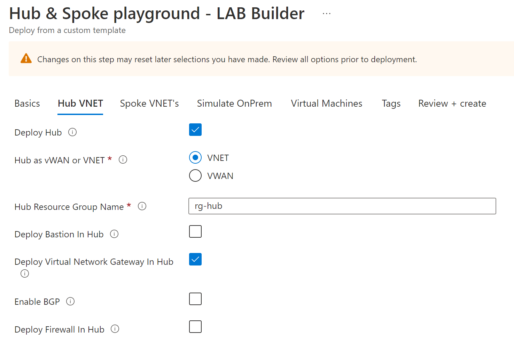
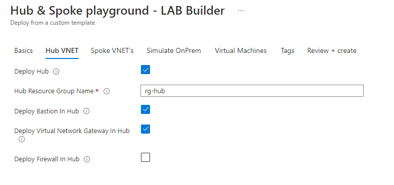
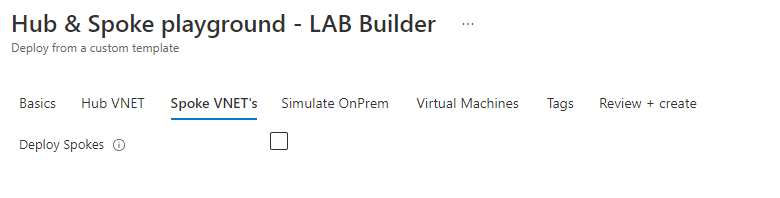
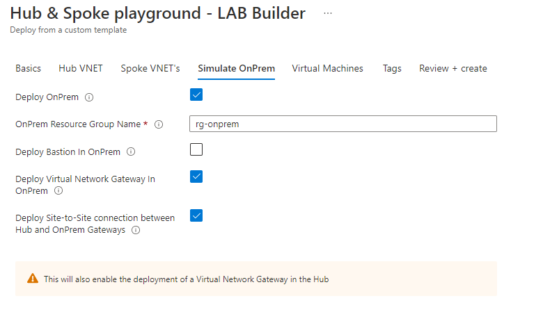
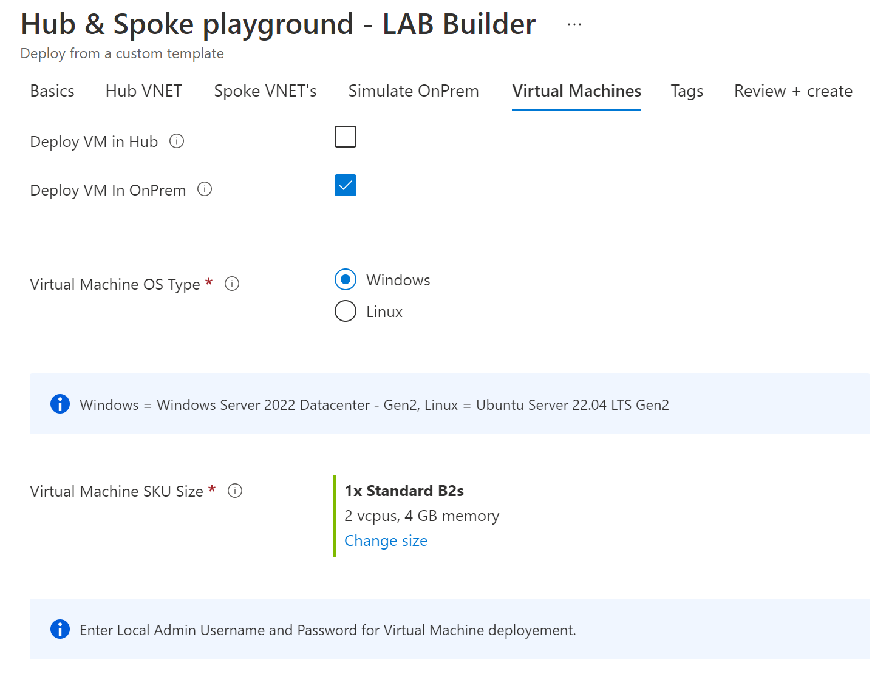
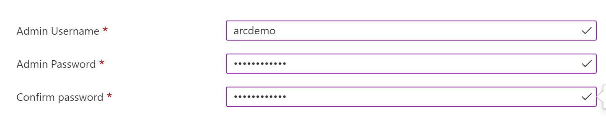

# Arc-enabled Windows Server - DemoLab
In this small demo environment I would like to show how easy it is to integrate a Virtual Machine into Azure Arc.

There are countless Github repositories that can be used to build a demo environment in Azure. I choose a repository that allows me to have multiple options at the same time. This repository deployed with Azure Bicep various Hub and Spoke networks. Therefore, I also saved myself the time and did not create a separate repository for it.

Put the right things together! ;-)


## Step 1 - Deploy Demo Lab via Bicep Github Repo
In this step we will create the basic environment in Azure. 

For this we need:
- one Hub Network
- one Spoke Network (for simulated OnPrem Hybrid connectivity)
- one Virtual Machine (Windows) in Spoke Network (OnPrem)

I use a Bastian Host for connecting to the Arc Windows VM in the Spoke Network instead of an Public IP.


### Deploy to Azure

| Description | Template |
|---|---|
| Deploy to Azure Subscription |[](https://portal.azure.com/#blade/Microsoft_Azure_CreateUIDef/CustomDeploymentBlade/uri/https%3A%2F%2Fraw.githubusercontent.com%2FPieterbasNagengast%2FAzure-HubSpoke-LabBuilder%2Fmain%2FARM%2Fmain.json/uiFormDefinitionUri/https%3A%2F%2Fraw.githubusercontent.com%2FPieterbasNagengast%2FAzure-HubSpoke-LabBuilder%2Fmain%2FuiDefinition.json)|

> :warning: **Warning:**
> **This deployment is meant for Demo, Test, Learning, Training, Practice or Reproduction purposes ONLY!!**
> **Please don't deploy to production environments!!**

> **Note**
> The original Repo is here: https://github.com/PieterbasNagengast/Azure-HubSpoke-LabBuilder


|Step|Screenshot|
|-|-|
|Fill out as shown||
|Fill out as shown||
|No Spoke VNet||
|Fill out as shown||
|One VM in Spoke OnPrem VNet||
|Admin Credentials||
|Setup Tags|fill out, what you want|
|Validate and Deploy|click ;-)|


## Step 2 - Config Azure Virtual Machine and onboard to Azure Arc

> **Note**
> The original Repo is here: https://azurearcjumpstart.io/azure_arc_jumpstart/azure_arc_servers/azure/azure_arm_template_win/

### Create a service principal
First you have to create a service principal for onboarding VM to Azure Arc.
``` 
 az login
 subscriptionId=$(az account show --query id --output tsv)
 az ad sp create-for-rbac -n "ArcSP" --role "Contributor" --scopes /subscriptions/$subscriptionId
```

### Register Azure Provider
In the next step you have to register some Azure Provider on your subscription. (only for the first time)
```  
 az provider register --namespace 'Microsoft.HybridCompute'
 az provider register --namespace 'Microsoft.GuestConfiguration'
``` 

### Login to VM
After you have successfully logged on to your VM you can now start this script to onboard the VM to Azure Arc.
The Virtual Machine was deployed with an PIP. So you can access via RDP. 

> **Note**
> Use this only für Testing and Demo. Please use ist not for production.


### VM Deployment
However, before we can create the Virtual Machine, we must first "read" the parameters to populate the azuredeploy.parameters.json file.

```
vmSize =
vmName =
adminUsername =
adminPassword =
resourceGroup = rg-hub
appId =
password =
tenantId =
subscriptionId =
location =
```

Once the parameters are found and entered into the file, we can now start the deployment.

```
az group create --name Arc-Servers-Win-Demo --location "west europe" --tags "Project=azure_arc_servers"
az deployment group create --resource-group rg-onprem --name arcwinsrvdemo --template-file C:\temp\Arc-enabledWinServersDemoLab\ARM\azuredeploy.json --parameters https://raw.githubusercontent.com/chtwilfer/Arc-enabledWinServersDemoLab/main/ARM/azuredeploy.parameters.json
```

## Step 3 - Azure Portal - Arc Overview

1 to 3 pictures of Arc


