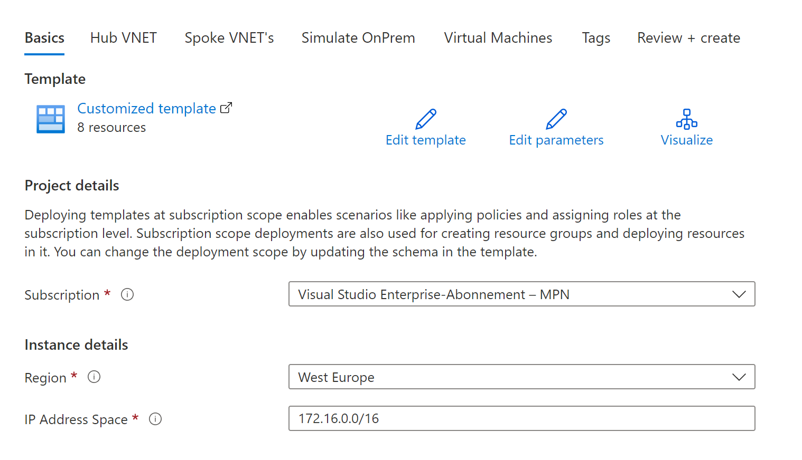

# Arc-enabled Windows Server - DemoLab
In this small demo environment I would like to show how easy it is to integrate a Virtual Machine into Azure Arc.

There are countless Github repositories that can be used to build a demo environment in Azure. I choose a repository that allows me to have multiple options at the same time. This repository deployed with Azure Bicep various Hub and Spoke networks. Therefore, I also saved myself the time and did not create a separate repository for it.

Put the right things together! ;-)


## Deploy Demo Lab via Bicep Github Repo
In this step we will create the basic environment in Azure. 

For this we need:
- one Hub Network
- one Spoke Network (for simulated OnPrem Hybrid connectivity)
- one Virtual Machine (Windows) in Spoke Network (OnPrem)

I use a Bastian Host for connecting to the Arc Windows VM in the Spoke Network instead of an Public IP.


### Deploy to Azure

| Description | Template |
|---|---|
| Deploy to Azure Subscription |[](https://portal.azure.com/#blade/Microsoft_Azure_CreateUIDef/CustomDeploymentBlade/uri/https%3A%2F%2Fraw.githubusercontent.com%2FPieterbasNagengast%2FAzure-HubSpoke-LabBuilder%2Fmain%2FARM%2Fmain.json/uiFormDefinitionUri/https%3A%2F%2Fraw.githubusercontent.com%2FPieterbasNagengast%2FAzure-HubSpoke-LabBuilder%2Fmain%2FuiDefinition.json)|

> :warning: **Warning:**
> **This deployment is meant for Demo, Test, Learning, Training, Practice or Reproduction purposes ONLY!!**
> **Please don't deploy to production environments!!**

> **Note**
> The original Repo is here: https://github.com/PieterbasNagengast/Azure-HubSpoke-LabBuilder


|Step|Screenshot|
|-|-|
|Fill out as shown||
|Fill out as shown||
|No Spoke VNet||
|Fill out as shown||
|One VM in Spoke OnPrem||
|Admin Credentials||
|Setup Tags|fill out, what you want|
|Validate and Deploy|click ;-)|


## Config Azure Virtual Machine and onboard to Azure Arc

> **Note**
> The original Repo is here: https://azurearcjumpstart.io/azure_arc_jumpstart/azure_arc_servers/azure/azure_arm_template_win/

### Login to Azure, select subscription and create a Service Principal

``` 
 az login
 Get-AzSubscription | Where-Object -Property State -eq "Enabled" | Out-Gridview -PassThru | Select-AzSubscription
 az ad sp create-for-rbac -n "ArcSP" --role "Contributor" --scopes /subscriptions/$subscriptionId
```


### Register Azure Provider
In the next step you have to register some (three) Azure Provider on your subscription. (only for the first time)
```  
 az provider register --namespace 'Microsoft.HybridCompute'
 az provider register --namespace 'Microsoft.GuestConfiguration'
 az provider register --namespace 'Microsoft.HybridConnectivity'
``` 


### Login to VM
With Azure Bastion you can now logon to your Windows VM. 
Next step is to use this script (https://raw.githubusercontent.com/chtwilfer/Arc-enabledWinServersDemoLab/main/install_arc_agent.ps1) with Powershell and admin rights to create another script with which you can start the onboarding to Azure Arc.


Copy and paste "install_arc_agent.ps1" to your Windows VM and start the script with admin rights. 
After starting the script you have to fill these parameters:
```
    $subscriptionId,
    $appId,
    $password, (=> AppID password)
    $tenantId,
    $resourceGroup,
    $location,
    $adminUsername
```
Now there is an new folder on C:\temp. In this folder there is a new "LogonScript.ps1".
With this script you now are able to onboard this VM to Azure Arc. Start this script with Powershell and admin rights.


## Step 3 - Azure Portal - Arc Overview

1 to 3 pictures of Arc


